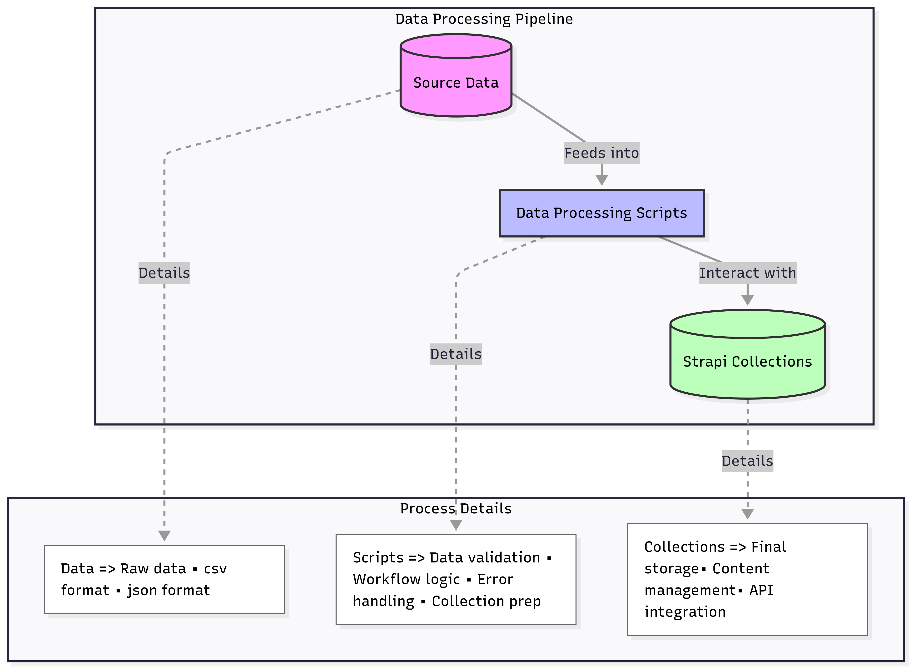
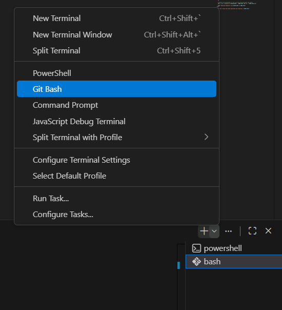

# Needs Assessment Information - Historic Data

The current needs assessment information utilized for this documentation was obtained from the historic needs data. It is filtered through scripts that process the data to ensure specific requirements are met prior to uploading the information to the Strapi collections. The data can then be accessed through Strapi API endpoints for frontend integration. (See the diagram below for an overview of this process.)



## Table of Contents

- [Needs Assessment Information - Historical Data](#needs-assessment-information---historic-data)
- Data Processing Scripts
- Strapi Collections
- [Troubleshooting](#troubleshooting)

## Troubleshooting

If you experience errors while setting up your local environment or running Strapi, start here for solutions to common issues.

Before you start, ensure you have the suggested packages and dependencies (version specific) from the repository readme installed (Node.js, Node version Manager, Yarn).

### Common Issues
1. Strapi Admin build fails because environment keys are missing
2. Local environment setup (Windows OS)

#### Strapi: Admin build fails because environment keys are missing

Error Message: 
    
`Missing admin.auth.secret configuration. The SessionManager requires a JWT secret`

Applies To:

 - Windows OS

 - PowerShell, Command Prompt

Cause: 
    
The command `./setup.bash` to auto-generate keys fails.

Solution:

1. In the code editor, open a new Git Bash terminal. *See Figure 1.*

<figure>
  
  <figcaption><strong>Figure 1.</strong> Git Bash selected as the new terminal to open.</figcaption>
</figure>

2. Enter `./setup.bash` to auto-generate the keys. If successful, skip to step 6, otherwise proceed to step 3.
3. Create a `.env` file in the root directory.
4. Copy the contents from the `.env.example` file and paste them into the new `.env` file.
5. Enter `openssl rand -base64` to generate each key. Copy and paste each key into a placeholder spot. Repeat until all **8** keys have replaced the placeholders.
6. Enter `yarn develop` in either the Powershell or Git Bash terminal to start the server. 

Verification:

The Strapi admin panel loads in a browser without key-related errors; logs show the server is running successfully.

#### Local environment setup (Windows OS)

Error Message:

`@swc/core "Failed to load native binding"`

Applies To:

- Windows OS

Cause: 

Solution:

1. Force classic node_modules and platform lock in **.yarnrc.yml**:
```
nodeLinker: node-modules
yarnPath: .yarn/releases/yarn-4.12.0.cjs
enableScripts: true
supportedArchitectures:
  os:
    - current
  cpu:
    - current
  libc:
    - current
```

2. In a new terminal/powershell window, install yarn:
```
corepack enable
yarn set version 4.12.0
```

3. Check the yarn version installed is correct:
```
yarn -v
```

4. Clean and reinstall core dependencies:


