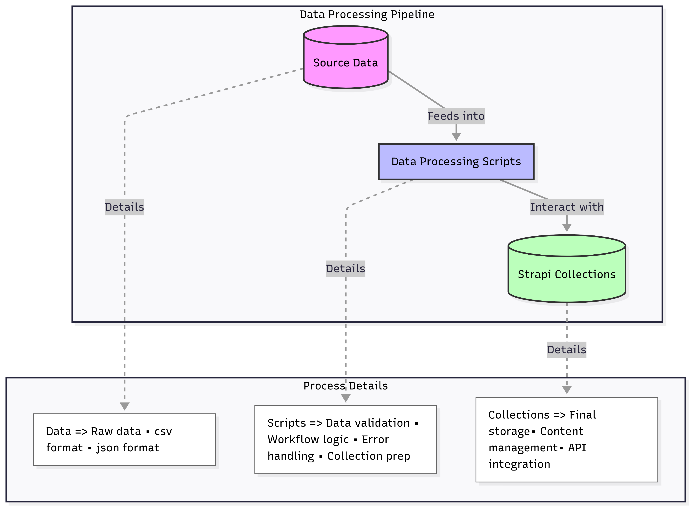

# Needs Assessment Information - Historic Data

The current needs assessment information utilized for this documentation was obtained from the historic needs data. It is filtered through scripts that process the data to ensure specific requirements are met prior to uploading the information to the Strapi collections. The data can then be accessed through Strapi API endpoints for frontend integration. (See the diagram below for an overview of this process.)

## Table of Contents

- [Needs Assessment Information - Historical Data](#needs-assessment-information---historic-data)
- Data Processing Scripts
- Strapi Collections
- [Troubleshooting](#troubleshooting)

## Troubleshooting

Some points to note if experiencing issues when getting the repo running in a local dev environment or possible GitHub codespace requirements.
