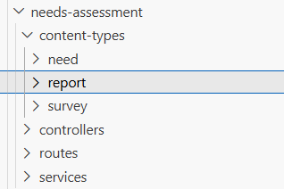
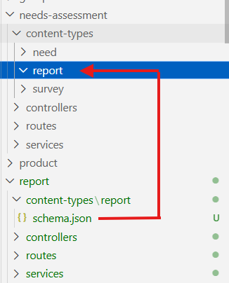
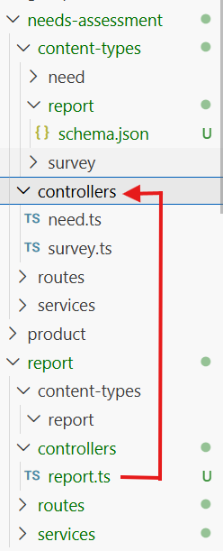
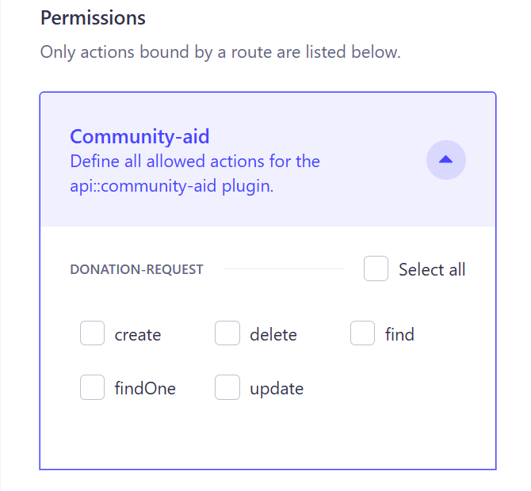

# Needs Assessment Strapi Collections

## Overview of Needs Assessment Collections

The **Needs Assessment** compiles global data on the needs of various groups across countries, regions, and subregions.

This data is modeled in **Strapi** as a set of **collections**, each representing specific aspects of the data.

These collections provide a structured data source that supports efficient querying and filtering in the frontend, allowing users to explore and display needs information by location, category, or other relevant attributes.

## Table of Contents

- [Overview of Needs Assessment Collections](#overview-of-needs-assessment-collections)
- [What's in a Collection](#whats-in-a-collection)
- [Naming Conventions for the Strapi Collections](#naming-conventions-for-the-strapi-collections)
- [How to Create a Collection](#how-to-create-a-collection)
- [How to Rename a Collection](#how-to-rename-a-collection)
- [How to Confirm and Verify a Collection](#how-to-confirm-and-verify-a-collection)
- [List of Strapi Collections Related to the Needs Assessment](#list-of-strapi-collections-related-to-the-needs-assessment)

## What's in a Collection

A **collection** is one of Strapi's three content-types (formally called a _collection type_). It contains fields that define the data structure for that collection. Fields can be added when creating the collection or later during edits and updates.

### Viewing a Collection
To view a collection in Strapi:
1. Ensure the **Strapi Admin Panel** is running in your browser.

2. Select the **Content Manager** icon from the navigation menu (see Figure 2.1). A list of available collections will appear.

<figure>
  
  <figcaption><strong>Figure 2.1.</strong> Strapi Content Manager icon in the navigation menu.</figcaption>
</figure>

3. Click the name of the collection you want to view (for example, `Product.Category`)

4. The main panel should now display the collection title and a table showing several of its fields. If entries exist, they'll appear as rows in the table.

5. To view or customize the displayed fields, select the **View settings** toggle above the top-right corner of the table (see Figure 2.2). 

<figure>
  
  <figcaption><strong>Figure 2.2.</strong> View settings toggle.</figcaption>
</figure>

- In this panel, you can:
    * Choose which fields to display
    * Reset the default view
    * Configure the display order of fields

### Automatically Generated Fields
Strapi automatically creates and populates the following fields in every collection:

* `id`
* `createdAt`
* `createdBy`
* `documentId`
* `updatedAt`
* `updatedBy`

Other fields (such as `name`) are determined by the data requirements specific to each collection and are added manually during collection creation or during updates. 

Some collections also contain auto-populated fields configured during setup. For details about these specific fields, see [our field types documentation](./field-types.md).

For more information on Strapi content-types, including the collection type, and creating content-types manually, see these [Strapi docs](https://docs.strapi.io/cms/features/content-type-builder).

>**NOTE**: All current Strapi collections related to Needs Assessment have been created manually. They were not generated using Strapi's AI features.

## Naming Conventions for the Strapi Collections

Most Strapi collection names follow a **two-level naming structure** that reflects both the core concept (parent/umbrella category) and a specific aspect within that category (subcomponent).

### Structure

`<CoreConcept>.<SpecificAspect>`
* **CoreConcept** - Represents the parent or umbrella category (e.g. `Product`, `Geo`, `NeedsAssessment`).

* **SpecificAspect** - Distinct subcomponent within that category.

#### Examples

| Collection Name   | Core Concept   | Specific Aspect   | Description   |
|--------------------|-----------------|---------------|----------------------------|
|`Product.Category`|Product|Category| List of product categories.|
|`Product.Item`|Product|Item| List of product items.|
|`NeedsAssessment.Survey`|NeedsAssessment|Survey|Surveys for the needs assessment.|
|`NeedsAssessment.Need`|NeedsAssessment|Need|Collected needs from previous assessments.|


### Purpose
This convention ensures clear organization, consistent naming, and easier navigation of collections across the Strapi admin and codebase. It supports scalability as new aspects are added under existing core parent categories.

## How to Create a Collection

Use this process when adding a new collection. 

### Before You Start
- Review [Naming Conventions for the Strapi Collections](#naming-conventions-for-the-strapi-collections).
- Decide whether the collection needs the two-level structure (`CoreConcept.SpecificAspect`) or just `SpecificAspect`.
- Identify the **CoreConcept** and **SpecificAspect** for the new collection.
- Review [Strapi Content-Type Builder overview](https://docs.strapi.io/cms/features/content-type-builder#overview).
- Start your server ([Instructions for Running a Local Site](https://github.com/distributeaid/aggregated-public-information#running-a-local-site))

**Note:** Strapi does not support dotted collection names natively. Create the collection in the admin panel using only the **SpecificAspect**, then rename it via CLI to align with the naming conventions if a two-level name is required.

---
### Option 1 - Create a New Collection (SpecificAspect only) in the Strapi Admin Panel

Use this when introducing a brand new concept or creating a collection before aligning it to naming conventions.

1. Open the Strapi admin panel and go to **Content-Type Builder**.
2. Select the icon to **Create new collection type**.
3. In **Display name**, enter the **SpecificAspect** (for example, `Request`).
4. In **Advanced Settings**, enable **Draft and Publish**.
5. Click **Continue**.
6. Add the required fields for the collection and configure their settings.
7. Click **Save** to update the collection.

If this collection needs to be renamed so it aligns with the two-level naming structure (`<CoreConcept>.<SpecificAspect>`) and the **CoreConcept** does not already exist, continue to [How to Rename a Collection](#how-to-rename-a-collection).

### Option 2 - Add a new Collection Under an Existing CoreConcept

Use this when the CoreConcept already exists (e.g., `NeedsAssessment`) and you're creating another collection for that parent category with a new SpecificAspect (e.g., `Report`).

1. Decide which **CoreConcept** this collection belongs to (e.g., `NeedsAssessment`).
2. Follow the steps in **Option 1**, then return here.
3. Back in the code editor, create a new folder for the **SpecificAspect** in the content-types folder of the already existing **CoreConcept folder** (See Figure 4.1). 

<figure>
  
  <figcaption><strong>Figure 4.1.</strong> Create the SpecificAspect folder inside existing CoreConcept folder (e.g., needs-assessment/content-types/).</figcaption>
</figure>

4. Drag the schema.json file from the new collection Strapi made and drop it into the newly created **SpecificAspect** folder (See Figure 4.2).

<figure>
  
  <figcaption><strong>Figure 4.2.</strong> Moving schema.json  to new SpecificAspect folder (e.g., needs-assessment/content-types/report/).</figcaption>
</figure>

5. Update the "displayName" in the schema.json file to align with the naming structure `<CoreConcept>.<SpecificAspect>`:

   ```bash
   ## In our example, this would be:

   "displayName": "NeedsAssessment.Report"   
   ```
6. Drag the specificAspect.ts file from the controllers folder in the new collection Strapi just made and drop it into the controllers folder of the core-concept folder (See Figure 4.3).

<figure>
  
  <figcaption><strong>Figure 4.3.</strong> Move controller file (e.g., report.ts) to the controllers folder of the core-concept (e.g., needs-assessment/controllers/).</figcaption>
</figure>

7. Repeat Step 6 for the specificAspect.ts files in the routes and services folders.

8. Delete the Strapi-made _SpecificAspect_ collection folder (along with all its contents):

   ```bash
   ## In our example:

   rm -rf src/api/report
   ```
9. Manually correct all the specificAspect.ts files in the controllers, routes, and services folder to hold the correct API ID (e.g., `api::report.report` becomes `api::needs-assessment.report`)
   
   Note: A type error may show up for the new API ID. This gets resolved in the next step.

10. Manually update the types in the terminal:

      ```bash
      yarn strapi ts:generate-types
      ```

11. Restart the server:

      ```bash
      yarn develop
      ```
12. Proceed to [How to Confirm and Verify a Collection](#how-to-confirm-and-verify-a-collection).

## How to Rename a Collection  

### General Renaming Pattern

Most renaming scenarios follow this sequence. Variations do occur for the order of the steps and are noted in individual scenarios. **CLI prompt answers** will also differ as they are specific to each scenario.

1. **Open** a terminal at the project root.
2. **Run CLI generator** (`yarn strapi generate`).
3. **Answer prompts** with target API ID values (scenario-specific).
4. **Copy attributes** from the initial Strapi collection schema.json file to the newly renamed collection schema.json file.
5. **Delete** the initial Strapi collection created (`rm -rf src/api/[initial-collection]` - replace the brackets with the name of the original collection)
6. **Restart** the server to update types (`yarn develop`).
7. **Check** API ID references are updated in the codebase:

   - .ts files in controllers, routes, and services 
   - types/generated
8. **Proceed** to [How to Confirm and Verify a Collection](#how-to-confirm-and-verify-a-collection).

---

#### Scenario 1 - Align a Collection to the Naming Conventions

Use this when you need to rename a collection that does not have an existing **CoreConcept**, and is following the two-level naming structure.

**Example:** 
   - Content-Type Display name `Request` becomes `Aid.Request`
   - API ID changes from `api::request.request` to `api::aid.request`

**Prompt Answers:**

   ```bash
   ? Strapi Generators (Use arrow keys)
       api - Generate a basic API 
       controller - Generate a controller for an API 
     ❯ content-type - Generate a content type for an API 
       policy - Generate a policy for an API 
       middleware - Generate a middleware for an API 
       migration - Generate a migration 
       service - Generate a service for an API
   ? Content type display name Aid.Request        # two-level structure
   ? Content type singular name request           # SpecificAspect
   ? Content type plural name requests
   ? Please choose the model type  Collection Type 
   ? Do you want to add attributes? No
   ? Where do you want to add this model? Add model to new API 
   ? Name of the new API? aid                     # CoreConcept
   ? Bootstrap API related files? Yes
   ```

**Steps:** Follow the [General Renaming Pattern](#general-renaming-pattern) above.

---

#### Scenario 2 - Refine the Subcomponent (**SpecificAspect**)
Use this to rename a collection where the **CoreConcept** is already established and the **SpecificAspect** needs to be more descriptive.

**Example:** 
   - Content-Type Display name `Aid.Request` becomes `Aid.DonationRequest`
   - API ID changes from `api::aid.request` to `api::aid.donation-request`.

**Prompt Answers:**

```bash
   ? Strapi Generators (Use arrow keys)
       api - Generate a basic API 
       controller - Generate a controller for an API 
     ❯ content-type - Generate a content type for an API 
       policy - Generate a policy for an API 
       middleware - Generate a middleware for an API 
       migration - Generate a migration 
       service - Generate a service for an API
   ? Content type display name Aid.DonationRequest    # two-level structure
   ? Content type singular name donation-request      # SpecificAspect
   ? Content type plural name donation-requests
   ? Please choose the model type  Collection Type 
   ? Do you want to add attributes? No
   ? Where do you want to add this model? Add model to an existing API 
   ? Which API is this for? aid                       # CoreConcept
   ? Bootstrap API related files? Yes
   ```

**Steps:** Follow the [General Renaming Pattern](#general-renaming-pattern). 

⚠️ **Step 5 Variation:** Be sure to keep the **CoreConcept** folder and _only_ delete the initial **SpecificAspect** collection and its related files.

   ```bash
   ## In our example, you would delete the following files with this command:

   rm -rf src/api/aid/content-types/request src/api/aid/controllers/request.ts src/api/aid/routes/request.ts src/api/aid/services/request.ts
   ```
Continue remaining steps as written.

---

#### Scenario 3 - Refine the Parent Category (**CoreConcept**)
Use this to rename a collection that needs a refined **CoreConcept**.

**Example:** 
   - Content-Type Display name `Aid.DonationRequest` becomes `CommunityAid.DonationRequest`
   - API ID changes from `api::aid.donation-request` to `api::community-aid.donation-request`.

**Steps: (Order Variation from the General Pattern occurs)** 

1. **Open** a terminal at the project root.
2. **Copy attributes** from the initial Strapi collection schema.json file:
   ```bash
   ## In our example, you would copy the attributes from this file:

   src/api/aid/content-types/donation-request/schema.json
   ```

3. **Delete** the initial Strapi collection created: 
   ```bash
   rm -rf src/api/[initial-collection] 
   
   ## Replace [initial-collection] with your original collection name
   ## Example: rm -rf src/api/aid
   ```
4. **Verify** all references of the initial collection have been removed from:
   
   - src/api/
   -  types/generated/contentTypes.d.ts

5. **Run CLI generator** (`yarn strapi generate`)
6. **Answer prompts** with target API ID values:
   ```bash
   ? Strapi Generators (Use arrow keys)
       api - Generate a basic API 
       controller - Generate a controller for an API 
     ❯ content-type - Generate a content type for an API 
       policy - Generate a policy for an API 
       middleware - Generate a middleware for an API 
       migration - Generate a migration 
       service - Generate a service for an API
   ? Content type display name CommunityAid.DonationRequest  # two-level structure
   ? Content type singular name donation-request             # SpecificAspect
   ? Content type plural name donation-requests
   ? Please choose the model type  Collection Type 
   ? Do you want to add attributes? No
   ? Where do you want to add this model? Add model to new API 
   ? Name of the new API? community-aid                      # CoreConcept
   ? Bootstrap API related files? Yes
   ```
7. **Paste** the copied attributes from Step 2 into the newly renamed collection schema.json file.
   ```bash
   ## In our example, you would paste the attributes into this file:

   src/api/community-aid/content-types/donation-request/schema.json
   ```
8. **Restart** the server to update types (`yarn develop`)
9. **Check** API ID references are updated in the codebase.

   - .ts files in controllers, routes, and services 
   - types/generated
10. **Proceed** to [How to Confirm and Verify a Collection](#how-to-confirm-and-verify-a-collection).

## How to Confirm and Verify a Collection
Use this process to confirm that a collection was created or renamed correctly and that it is accessible via the API.

### 1. Confirm the Collection in Content-Type Builder
1. In the Strapi admin panel, open **Content-Type Builder**.
2. Confirm the collection appears in the list and open it.
3. Verify that all required fields are present.
4. Check that **Draft and Publish** is enabled.

   - Click **Edit** to view the collection settings.
   - Open the **Advanced Settings** tab.
   - Ensure **Draft and Publish** is selected.
   - Click **Finish**, then **Save**.
   - Wait for Strapi to restart.

5. In your code editor, confirm `draftAndPublish` is enabled in the schema.json file: 
      ```json
      "options": {
         "draftAndPublish": true
      },
      ```

### 2. Enable Permissions for the Collection
Updating permissions allows the collection to be accessed via the public API.

1. In the Strapi Admin panel, go to **Settings**.
2. Under **Users & Permissions Plugin**, select **Roles**.
3. Select the **Public** role.
4. In **Permissions**, expand the entry for the collection to define actions for the api plugin (See Figure 6.1).

  <figure>
  
  <figcaption><strong>Figure 6.1.</strong> Collection entry expanded for selection of allowed actions.</figcaption>
   </figure>

5. Select the actions to allow for this collection (for example, **find**, **findOne**). 

6. Click **Save**.

### 3. Confirm the Collection in Content Manager
1. In the navigation bar, select **Content Manager**.
2. Confirm the collection appears in the list and select it.
3. Click **Create new entry**.
4. Enter values for the collection fields.
5. Click **Save** (to save as a draft) or **Publish**.

   **Note:** Only **published** entries are accessible via API requests. Use **Publish** for API verification.

6. Confirm that:

   - A document ID appears above the entry.
   - The entry appears in the list (select **Back** to verify).

   Expected behaviour: You can add values to all required fields, save or publish without errors, and see the entry in the collection list with an ID.

### 4. Verify the API Endpoint Returns Data
1. Open an API test tool (for example, Postman or Bruno).
2. Send a GET request to the collection endpoint:

   ```bash
   [base_url]/api/[pluralName of collection]?populate=*
   ```

   Example:
   ```bash    
   http://localhost:1337/api/donation-requests?populate=*
   ```
3. Confirm that:

    - The response status is a `200 OK`.
    - The `data` array contains the entry or entries you created.
    - Nested data is included when `?populate=*` is used.

   **Note:** If the collection has no entries, the request returns `200 OK` with an empty `data` array.

### 5. Clean Up Test Data
1. In **Content Manager**, open the collection.
2. Delete all test entries created during verification.

## List of Strapi Collections Related to the Needs Assessment

The following collections support the Needs Assessment:

### Collections

   - [`NeedsAssessment.Need`](./needs-collection.md) - Stores historic needs.
   - [`NeedsAssessment.Survey`](./survey-collection.md) - Stores surveys used to assess needs across areas. 
   - [`Geo.region`](./region-collection.md) - Stores regions where needs have been established. 
   - [`Geo.subregion`](./subregion-collection.md) - Stores subregions where needs have been established. 
   - [`Product.Item`](./item-collection.md) - Stores items requested across areas. 

### Relations
`NeedsAssessment.Need` includes **relation fields** to:
- `NeedsAssessment.Survey` 
- `Geo.region` 
- `Geo.subregion`
- `Product.Item` 

For **relation field** details, see [field-types](./field-types.md).

### Current Inventory
View the full list of collections available in our Strapi CMS through **Content Manager** or **Content-Type Builder** in the Strapi admin panel.   
