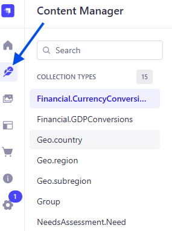
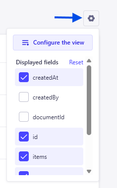

The **Needs Assessment** compiles global data on the needs of various groups across countries, regions, and subregions.

This data is modeled in **Strapi** as a set of **collections**, each representing specific aspects of the data.

These collections provide a structured data source that supports efficient querying and filtering in the frontend, allowing users to explore and display needs information by location, category, or other relevant attributes.

## What's in a Collection

A **collection** is one of Strapi's three content-types (formally called a _collection type_). It contains fields that define the data structure for that collection. Fields can be added when creating the collection or later during edits and updates.

### Viewing a Collection

To view a collection in Strapi:

1. Ensure the **Strapi Admin Panel** is running in your browser.

2. Select the **Content Manager** icon from the navigation menu (see Figure 1). A list of available collections will appear.

**Figure 1.** Strapi Content Manager icon in the navigation menu.

3. Click the name of the collection you want to view (for example, `Product.Category`)

4. The main panel should now display the collection title and a table showing several of its fields. If entries exist, they'll appear as rows in the table.

5. To view or customize the displayed fields, select the **View settings** toggle above the top-right corner of the table (see Figure 2).

**Figure 2.** View settings toggle.

- In this panel, you can:
  - Choose which fields to display
  - Reset the default view
  - Configure the display order of fields

### Automatically Generated Fields

Strapi automatically creates and populates the following fields in every collection:

- `id`
- `createdAt`
- `createdBy`
- `documentId`
- `updatedAt`
- `updatedBy`

Other fields (such as `name`) are determined by the data requirements specific to each collection and are added manually during collection creation or during updates.

Some collections also contain auto-populated fields configured during setup. For details about these specific fields, see the [field types documentation](/needs-assessment/field-types/).

For more information on Strapi content-types, including the collection type, and creating content-types manually, see these [Strapi docs](https://docs.strapi.io/cms/features/content-type-builder).

> **NOTE**: All current Strapi collections related to Needs Assessment have been created manually. They were not generated using Strapi's AI features.

## Naming Conventions

Most Strapi collection names follow a **two-level naming structure** that reflects both the core concept (parent/umbrella category) and a specific aspect within that category (subcomponent).

### Structure

`<CoreConcept>.<SpecificAspect>`

- **CoreConcept** - Represents the parent or umbrella category (e.g. `Product`, `Geo`, `NeedsAssessment`).
- **SpecificAspect** - Distinct subcomponent within that category.

#### Examples

| Collection Name          | Core Concept    | Specific Aspect | Description                                |
| ------------------------ | --------------- | --------------- | ------------------------------------------ |
| `Product.Category`       | Product         | Category        | List of product categories.                |
| `Product.Item`           | Product         | Item            | List of product items.                     |
| `NeedsAssessment.Survey` | NeedsAssessment | Survey          | Surveys for the needs assessment.          |
| `NeedsAssessment.Need`   | NeedsAssessment | Need            | Collected needs from previous assessments. |

### Purpose

This convention ensures clear organization, consistent naming, and easier navigation of collections across the Strapi admin and codebase. It supports scalability as new aspects are added under existing core parent categories.
