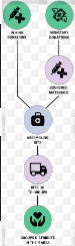
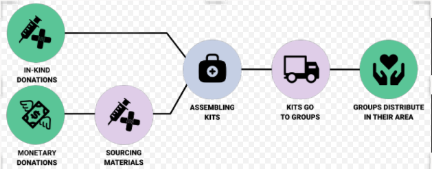

# Response.Overview Content Guide

## Purpose
The Response.Overview collection holds entries for each response that Distribute Aid is or has been involved with.

## How this content reaches the website
Entries from this collection are used to create response cards on the Response Overview page, as well as individual response pages that provide greater detail relating to that specific project. Only entries that are **published** will display on the website. 

## Before you begin

## Open the collection

## Top-level fields 
| Field name   | Field type              | What to enter                                                                                  | Example                                         | Required? | Where it appears                 |
| ------------ | ----------------------- | ---------------------------------------------------------------------------------------------- | ----------------------------------------------- | --------- | -------------------------------- |
| name         | Short text              | Enter the name for this response.  | Levant Response                              | Yes       | - **Detailed Response page:** page heading  - **Response Overview page:** card heading |
| subheading   | Short text | Enter a brief one sentence description of the response.                  | We source harm reduction kits with ...

**Click to expand**
medical equipment that our partners then distribute to trans people who take injection-based gender affirming hormone therapy.
 | No        | - **Detailed Response page:** below page heading      |
| description  | Rich text               | Enter a detailed description of what we provide for this response.                                           | We deliver supplies to ...

**Click to expand**
refugee camps, community centers, and grassroots groups serving people on the move. We also work with a network of organizations across the continent to help them be more sustainable and effective by reducing costs and acquiring new sources of aid.
                    | Yes       | - **Detailed response page:** full description in About section  - **Response Overview page:** description preview followed by `...` in the card                |
| imageGallery  | Repeatable component               | Add one entry for each image. See the component instructions below. [TODO - add link to this component]                                           | ———                   | No       | - **Detailed Response page:** All images appear in the About section  - **Response Overview page:** The first image entered appears on the response card                |
| processImageMobile  | Strapi Media               | Select or upload the image that accurately displays the process the response follows. See [Process image mobile](#process-image-mobile) for the display example and image requirements.                                           | [View example](#process-image-mobile)                     | No       | - **Detailed response page:** How We Work section on mobile layouts                |
|  processImageDesktop  | Strapi Media               | Select or upload the image that accurately displays the process the response follows. See [Process image desktop](#process-image-desktop) for the display example and image requirements.                                           | [View example](#process-image-desktop)                    | No       | - **Detailed response page:** How We Work section on desktop layouts                |
| callToActionCards  | Repeatable component               | [TODO]                                           | [TODO]                    | No       | Cards that appear in the section on how to get involved on the detailed response page.                |
| faqs  | Repeatable component               | [TODO]                                          | [TODO]                    | No       | In the FAQ section of the detailed response page.                |
| slug   | Short text | No input required. This field autofills.                   | [TODO] | No        | [TODO]      |
| impactStatistics | Single component    | [TODO]                | —                                               | Yes        | Impact statistics section on the detailed response page.         |
| aboutHeading  | Short text               | Enter "About The" + the project name                                           | About The US Disaster Preparedness Project                    | No       | Heading for the About section of the response page.                |
| details  | Repeatable component               | [TODO]                                           | [TODO]                    | No       | Below the images in the About section, if applicable.                |
| processHeading  | Short text               | [TODO]Enter "About The" + the project name                                           | [TODO]                    | No       | Heading for the process image on the detailed response page.                |
| processFootnote  | Short text               | [TODO]Enter "About The" + the project name                                           | [TODO]                    | No       | Footnote for the process image on the detailed response page.                |
| fundraisers  | Relation               | Choose the fundraiser that is associated with the response. If applicable, choose additional fundraisers that can be associated with the response.                                           | [TODO]                    | No       | [TODO]                |

## Component fields

### impactStatistics

### statistics

### cta

## Image display examples

### Process image mobile

**Strapi field name:** `processImageMobile`  
**Source:** Strapi Media Library  
**What to enter:** Select an approved image from the Media Library or upload a new approved image from your computer.  
**Reuse option:** If this image is already used by another response process, follow [Reuse an existing Cloudinary image](). [TODO] test this 
**Note:** The process flows <u>vertically</u> in this image.

Click to view the image example

[↩ Back to the `processImageMobile` field in the table](#field-process-image-mobile)

### Process image desktop

**Strapi field name:** `processImageDesktop`  
**Source:** Strapi Media Library  
**What to enter:** Select an approved image from the Media Library or upload a new approved image from your computer.  
**Reuse option:** If this image is already used by another response process, follow [Reuse an existing Cloudinary image](). [TODO] TEST THIS 
**Note:** The process flows horizontally in this image.

Click to view the image example

[↩ Back to the `processImageDesktop` field in the table](#field-process-image-desktop)

## Save and publish

## Before publishing

## Troubleshooting

## Content ownership and maintenance